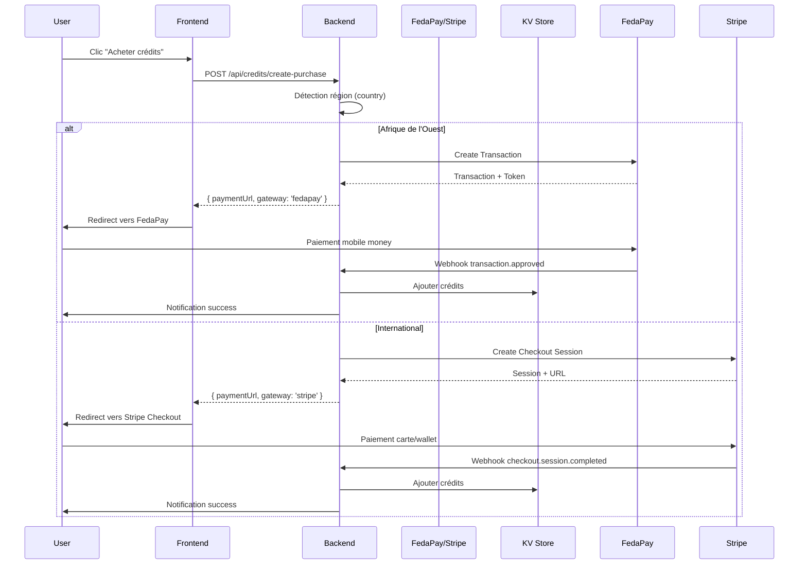
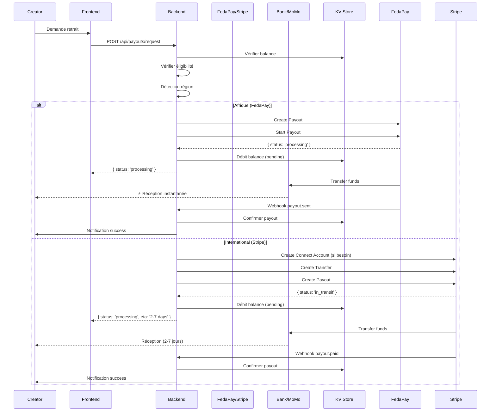

# 💳 PAYMENT ARCHITECTURE - Cortexia Creation Hub V3

**Version:** 1.0.0  
**Date:** 28 janvier 2026  
**Status:** ✅ Production Ready

---

## 🎯 VUE D'ENSEMBLE

Cortexia utilise une **architecture hybride dual-gateway** combinant **FedaPay** (Afrique de l'Ouest) et **Stripe** (International) pour optimiser l'expérience utilisateur et minimiser les frais de transaction selon la région géographique.

---

## 🏗️ ARCHITECTURE GLOBALE

```
┌─────────────────────────────────────────────────────────────┐
│              CORTEXIA PAYMENT SYSTEM V3                      │
│                   (Dual Gateway Strategy)                    │
└─────────────────────────────────────────────────────────────┘
                              │
                ┌─────────────┴─────────────┐
                │                           │
         ┌──────▼──────┐            ┌──────▼──────┐
         │   FedaPay   │            │   Stripe    │
         │  (Africa)   │            │ (Worldwide) │
         └─────────────┘            └─────────────┘
              │                            │
    ┌─────────┴─────────┐         ┌───────┴────────┐
    │                   │         │                │
Mobile Money      Bank Local   Cards Global   Bank Global
(Instant)        (1-3 days)   (Instant)      (2-7 days)
```

---

## 💰 1. ACHATS DE CRÉDITS

### **1.1 Individual Users** 🟦

#### **Option A: FedaPay (Afrique de l'Ouest)**

**Pays supportés:**
- 🇧🇯 Bénin
- 🇹🇬 Togo
- 🇨🇮 Côte d'Ivoire
- 🇸🇳 Sénégal
- 🇧🇫 Burkina Faso
- 🇲🇱 Mali
- 🇳🇪 Niger
- 🇬🇳 Guinée

**Méthodes de paiement:**
```yaml
Mobile Money:
  - MTN Mobile Money (Bénin, CI, Guinée, Niger)
  - Moov Money (Bénin, Togo, CI, Burkina)
  - Orange Money (Sénégal, Mali, Burkina, CI)
  - Wave (Sénégal, CI)
  - Togocel T-Money (Togo)
  - Airtel Money (Niger)
  - Celtiis Cash (Bénin)
  
Cartes Bancaires:
  - Visa
  - MasterCard
```

**Devises:**
- XOF (Franc CFA) - Devise principale
- GNF (Franc guinéen)

**Frais de transaction:**
- Mobile Money: ~2-3%
- Cartes: ~2.5-3%

**Flow technique:**
```typescript
// 1. Détection région
const userCountry = await getUserCountry(userId);

if (isFedaPayRegion(userCountry)) {
  // 2. Créer transaction FedaPay
  const transaction = await FedaPay.Transaction.create({
    description: `Achat ${creditsAmount} crédits Cortexia`,
    amount: amount * 100, // Convertir en centimes
    currency: { iso: 'XOF' },
    callback_url: `${BASE_URL}/api/fedapay/callback`,
    customer: {
      email: user.email,
      firstname: user.firstName,
      lastname: user.lastName,
      phone_number: {
        number: user.phoneNumber,
        country: userCountry
      }
    }
  });
  
  // 3. Générer token de paiement
  const token = await transaction.generateToken();
  
  // 4. Rediriger vers page FedaPay
  return {
    gateway: 'fedapay',
    paymentUrl: token.url,
    transactionId: transaction.id
  };
}
```

**Avantages:**
- ✅ Natif pour utilisateurs africains
- ✅ Pas de carte bancaire obligatoire
- ✅ Confirmation instantanée (mobile money)
- ✅ Frais compétitifs
- ✅ UX optimisée pour mobile

---

#### **Option B: Stripe (International)**

**Pays supportés:**
- 🌍 50+ pays (USA, Europe, Canada, Asie, etc.)

**Méthodes de paiement:**
```yaml
Cartes:
  - Visa, MasterCard, Amex
  - Cartes de débit

Digital Wallets:
  - Apple Pay
  - Google Pay
  - Link (Stripe wallet)
  
Virements:
  - SEPA (Europe)
  - ACH (USA)
  - iDEAL (Pays-Bas)
  - Bancontact (Belgique)
```

**Devises:**
- 135+ devises supportées
- Conversion automatique

**Frais de transaction:**
- Standard: 2.9% + $0.30
- Europe: 1.4% + €0.25 (cartes européennes)

**Flow technique:**
```typescript
// 1. Créer Stripe Checkout Session
const stripe = new Stripe(STRIPE_SECRET_KEY);

const session = await stripe.checkout.sessions.create({
  mode: 'payment',
  line_items: [{
    price_data: {
      currency: getCurrencyByCountry(userCountry),
      unit_amount: amount * 100,
      product_data: {
        name: `${creditsAmount} Cortexia Credits`,
        description: 'AI Media Generation Credits',
        images: ['https://cortexia.com/credits-icon.png']
      }
    },
    quantity: 1
  }],
  customer_email: user.email,
  metadata: {
    userId,
    creditsAmount: creditsAmount.toString(),
    type: 'credit_purchase',
    accountType: 'individual'
  },
  success_url: `${BASE_URL}/credits/success?session_id={CHECKOUT_SESSION_ID}`,
  cancel_url: `${BASE_URL}/credits`,
  payment_method_types: ['card', 'apple_pay', 'google_pay'],
  billing_address_collection: 'auto'
});

// 2. Rediriger vers Stripe Checkout
return {
  gateway: 'stripe',
  paymentUrl: session.url,
  sessionId: session.id
};
```

**Avantages:**
- ✅ Couverture mondiale
- ✅ UX optimisée (Checkout.js)
- ✅ Meilleure détection fraude (Radar)
- ✅ Multi-devises automatique
- ✅ Tax compliance (Stripe Tax)

---

### **1.2 Enterprise Users** 🟨

**Stripe UNIQUEMENT** (Worldwide)

#### **Abonnement Récurrent ($999/mois)**

```typescript
// 1. Créer Stripe Customer
const customer = await stripe.customers.create({
  email: enterpriseUser.email,
  name: enterpriseUser.companyName,
  metadata: {
    userId,
    accountType: 'enterprise',
    companySize: enterpriseUser.companySize
  }
});

// 2. Créer Subscription
const subscription = await stripe.subscriptions.create({
  customer: customer.id,
  items: [{
    price: 'price_enterprise_monthly_999' // Créé dans Stripe Dashboard
  }],
  metadata: {
    userId,
    creditsPerMonth: '10000',
    accountType: 'enterprise'
  },
  payment_settings: {
    save_default_payment_method: 'on_subscription'
  },
  expand: ['latest_invoice.payment_intent']
});

// 3. Enregistrer dans KV Store
await kv.set(`user:subscription:${userId}`, {
  stripeCustomerId: customer.id,
  stripeSubscriptionId: subscription.id,
  status: subscription.status,
  currentPeriodStart: subscription.current_period_start,
  currentPeriodEnd: subscription.current_period_end,
  monthlyCredits: 10000
});
```

**Renouvellement automatique:**
- ✅ Auto-renewal chaque mois
- ✅ Reset crédits mensuels le 1er du mois
- ✅ Webhooks pour gestion échecs paiement
- ✅ Factures automatiques (Stripe Invoicing)

---

#### **Add-on Credits (Persistants)**

```typescript
// Achat ponctuel crédits supplémentaires
const session = await stripe.checkout.sessions.create({
  mode: 'payment',
  customer: subscription.customer, // Customer existant
  line_items: [{
    price_data: {
      currency: 'usd',
      unit_amount: amount * 100,
      product_data: {
        name: `${creditsAmount} Add-on Credits`,
        description: 'Persistent credits (never expire)'
      }
    },
    quantity: 1
  }],
  metadata: {
    userId,
    creditsAmount: creditsAmount.toString(),
    type: 'addon_credits',
    accountType: 'enterprise'
  },
  success_url: `${BASE_URL}/enterprise/credits/success`,
  cancel_url: `${BASE_URL}/enterprise/credits`
});
```

**Caractéristiques:**
- ✅ Ne comptent pas dans les 10k mensuels
- ✅ N'expirent jamais
- ✅ Cumulables
- ✅ Visibles séparément dans balance

---

### **1.3 Developer Users** 🟪

**Stripe UNIQUEMENT** (API Usage)

```typescript
// Pay-as-you-go ou forfaits
const session = await stripe.checkout.sessions.create({
  mode: 'payment',
  line_items: [{
    price: 'price_developer_api_credits_100' // Forfait
  }],
  metadata: {
    userId,
    creditsAmount: '100000',
    type: 'api_credits',
    accountType: 'developer'
  },
  success_url: `${BASE_URL}/developer/credits/success`,
  cancel_url: `${BASE_URL}/developer/credits`
});
```

---

## 💸 2. RETRAITS (PAYOUTS) - Individual/Creator UNIQUEMENT

### **2.1 FedaPay Payouts (Afrique de l'Ouest)** ✅ **RECOMMANDÉ**

**Destinations supportées:**

```yaml
Mobile Money (Instantané):
  - MTN Bénin: mtn_open
  - Moov Bénin: moov
  - MTN Côte d'Ivoire: mtn_ci
  - Moov Togo: moov_tg
  - Togocel T-Money: togocel
  - Celtiis Bénin: sbin
  - Orange Burkina: orange_bf
  - Moov Burkina: moov_bf
  - MTN Guinée: mtn_open_gn
  - Moov CI: moov_ci
  - Wave CI: wave_ci
  - Orange CI: orange_ci
  - Wave Sénégal: wave_sn
  - Orange Sénégal: orange_sn

Comptes Bancaires (1-3 jours):
  - Banques locales UEMOA
```

**Configuration:**
```typescript
interface PayoutMethodFedaPay {
  type: 'mobile_money' | 'bank_account';
  provider: 'mtn_open' | 'moov' | 'mtn_ci' | 'wave_sn' | etc;
  phoneNumber?: string; // Pour mobile money
  bankDetails?: {
    accountNumber: string;
    bankName: string;
    iban?: string;
  };
}
```

**Seuil minimum:** 1000 FCFA (~$1.50)

**Frais:** 1-2% (très compétitif)

**Délais:**
- Mobile Money: **Instantané** ⚡
- Banque locale: 1-3 jours ouvrés

**Flow technique:**
```typescript
// 1. Créer FedaPay Payout
const payout = await FedaPay.Payout.create({
  amount: withdrawAmount, // En centimes
  currency: { iso: 'XOF' },
  mode: method.provider, // 'mtn_open', 'moov', etc.
  customer: {
    email: creator.email,
    firstname: creator.firstName,
    lastname: creator.lastName,
    phone_number: {
      number: method.phoneNumber,
      country: creator.country
    }
  }
});

// 2. Démarrer le payout
await FedaPay.Payout.start({
  payouts: [{ id: payout.id }]
});

// 3. Mettre à jour balance
const balance = await kv.get(`creator:balance:${userId}`);
balance.availableBalance -= withdrawAmount;
balance.pendingPayout += withdrawAmount;
await kv.set(`creator:balance:${userId}`, balance);

// 4. Enregistrer transaction
await logPayoutRequest({
  userId,
  payoutId: payout.id,
  amount: withdrawAmount,
  gateway: 'fedapay',
  method: method.provider,
  status: 'processing'
});
```

**Webhook confirmation:**
```typescript
// Événement: payout.sent
{
  "name": "payout.sent",
  "entity": {
    "id": "payout_12345",
    "amount": 5000,
    "status": "sent",
    "mode": "mtn_open",
    "customer": {
      "email": "creator@example.com"
    }
  }
}

// Action: Confirmer réception
balance.pendingPayout -= payout.amount;
balance.payoutHistory.push({
  id: payout.id,
  amount: payout.amount,
  date: new Date().toISOString(),
  status: 'completed',
  gateway: 'fedapay',
  method: payout.mode
});
```

**Avantages:**
- ✅ Retraits instantanés mobile money
- ✅ Pas de compte bancaire obligatoire
- ✅ Frais très bas (1-2%)
- ✅ Adapté aux créateurs africains
- ✅ Seuil minimum très bas ($1.50)

---

### **2.2 Stripe Connect Payouts (International)** ✅ **RECOMMANDÉ**

**Pays supportés:** 50+ pays

**Destinations:**
```yaml
Virements bancaires:
  - SEPA (Europe): 1-2 jours
  - ACH (USA): 2-5 jours
  - Wire Transfer (International): 3-7 jours

Cartes de débit:
  - Instant payouts (USA uniquement)
  - Frais: 1% (min $0.50)
```

**Configuration:**
```typescript
interface PayoutMethodStripe {
  type: 'bank_account' | 'debit_card';
  bankDetails?: {
    accountNumber: string;
    routingNumber: string; // USA
    iban?: string; // Europe
    swiftCode?: string; // International
  };
  cardDetails?: {
    last4: string;
    brand: string;
  };
}
```

**Seuil minimum:**
- USA: $25
- Europe: €25
- Variable selon pays

**Frais:**
- Standard: 0.25% (plafonné à $1-$2 selon pays)
- Instant Payouts: 1% (min $0.50)

**Délais:**
- Standard: 2-7 jours (selon pays)
- Instant: Quelques minutes (USA uniquement)

**Flow technique:**
```typescript
// 1. Créer/Récupérer Stripe Connect Account
let stripeAccountId = creator.stripeConnectAccountId;

if (!stripeAccountId) {
  const account = await stripe.accounts.create({
    type: 'express',
    country: creator.country,
    email: creator.email,
    capabilities: {
      transfers: { requested: true }
    },
    business_type: 'individual',
    individual: {
      email: creator.email,
      first_name: creator.firstName,
      last_name: creator.lastName
    }
  });
  
  stripeAccountId = account.id;
  creator.stripeConnectAccountId = stripeAccountId;
  await kv.set(`user:profile:${userId}`, creator);
}

// 2. Vérifier onboarding complet
const account = await stripe.accounts.retrieve(stripeAccountId);
if (!account.details_submitted) {
  // Rediriger vers onboarding link
  const accountLink = await stripe.accountLinks.create({
    account: stripeAccountId,
    refresh_url: `${BASE_URL}/creator/payouts/onboarding/refresh`,
    return_url: `${BASE_URL}/creator/payouts/onboarding/complete`,
    type: 'account_onboarding'
  });
  
  return {
    onboardingRequired: true,
    onboardingUrl: accountLink.url
  };
}

// 3. Créer Transfer vers Connect Account
const transfer = await stripe.transfers.create({
  amount: withdrawAmount, // En centimes
  currency: getCurrencyByCountry(creator.country),
  destination: stripeAccountId,
  metadata: {
    userId,
    type: 'creator_payout',
    accountType: 'individual'
  }
});

// 4. Créer Payout (bank transfer)
const payout = await stripe.payouts.create(
  {
    amount: withdrawAmount,
    currency: getCurrencyByCountry(creator.country),
    method: 'standard', // ou 'instant'
    statement_descriptor: 'Cortexia Payout',
    metadata: {
      userId,
      transferId: transfer.id
    }
  },
  { stripeAccount: stripeAccountId }
);

// 5. Mettre à jour balance
const balance = await kv.get(`creator:balance:${userId}`);
balance.availableBalance -= withdrawAmount;
balance.pendingPayout += withdrawAmount;
await kv.set(`creator:balance:${userId}`, balance);

// 6. Enregistrer transaction
await logPayoutRequest({
  userId,
  payoutId: payout.id,
  transferId: transfer.id,
  amount: withdrawAmount,
  gateway: 'stripe',
  status: 'processing',
  estimatedArrival: payout.arrival_date
});
```

**Webhook confirmation:**
```typescript
// Événement: payout.paid
{
  "type": "payout.paid",
  "data": {
    "object": {
      "id": "po_12345",
      "amount": 5000,
      "status": "paid",
      "arrival_date": 1643328000,
      "metadata": {
        "userId": "user123",
        "transferId": "tr_12345"
      }
    }
  }
}

// Action: Confirmer réception
balance.pendingPayout -= payout.amount;
balance.payoutHistory.push({
  id: payout.id,
  amount: payout.amount,
  date: new Date(payout.arrival_date * 1000).toISOString(),
  status: 'completed',
  gateway: 'stripe'
});
```

**Avantages:**
- ✅ Couverture mondiale (50+ pays)
- ✅ Multi-devises automatique
- ✅ Tax compliance (1099, etc.)
- ✅ Dashboard transparent
- ✅ Support professionnel
- ✅ Instant payouts (USA)

---

## 🔄 FLOWS COMPLETS

### **Flow 1: Achat de Crédits (Individual)**



---

### **Flow 2: Retrait (Creator)**



---

## 📊 TABLEAU COMPARATIF

| Critère | FedaPay | Stripe |
|---------|---------|--------|
| **Géographie** | Afrique Ouest (8 pays) | Mondial (50+ pays) |
| **Achats Credits** | ✅ Mobile Money + Cartes | ✅ Cartes + Wallets |
| **Payouts** | ✅ Instantané (mobile money) | ✅ 2-7 jours (banque) |
| **Frais Achats** | 2-3% | 2.9% + $0.30 |
| **Frais Payouts** | 1-2% | 0.25% - 2% |
| **Seuil Min Retrait** | 1000 FCFA (~$1.50) | Variable ($25+ USA) |
| **Devises** | XOF, GNF | 135+ devises |
| **UX Mobile** | ⭐⭐⭐⭐⭐ | ⭐⭐⭐⭐ |
| **Tax Compliance** | ⚠️ Limité | ✅ Complet (Stripe Tax) |
| **Webhooks** | ✅ Robustes | ✅ Très robustes |
| **Dashboard** | ⭐⭐⭐⭐ | ⭐⭐⭐⭐⭐ |
| **Support** | ⭐⭐⭐ | ⭐⭐⭐⭐⭐ |

---

## 🗄️ STRUCTURE KV STORE

### **Balance Creator (Individual)**

```typescript
interface CreatorBalance {
  userId: string;
  totalEarned: number;          // Total commissions accumulées
  availableBalance: number;     // Solde disponible pour retrait
  pendingPayout: number;        // Retrait en cours
  totalWithdrawn: number;       // Total retiré historique
  lastPayoutDate: string | null;
  lastPayoutAmount: number;
  payoutHistory: PayoutRecord[];
  createdAt: string;
  updatedAt: string;
}

interface PayoutRecord {
  id: string;
  amount: number;
  gateway: 'fedapay' | 'stripe';
  method: string; // 'mtn_open', 'bank_account', etc.
  status: 'pending' | 'processing' | 'completed' | 'failed';
  date: string;
  arrivalDate?: string;
  fees: number;
  netAmount: number;
  currency: string;
  metadata?: Record<string, any>;
}

// Clé KV
// creator:balance:{userId}
```

---

### **Configuration Payout**

```typescript
interface PayoutConfig {
  userId: string;
  region: 'africa' | 'international';
  preferredGateway: 'fedapay' | 'stripe';
  
  // FedaPay
  fedapay?: {
    method: 'mobile_money' | 'bank_account';
    provider: 'mtn_open' | 'moov' | 'mtn_ci' | 'wave_sn' | etc;
    phoneNumber?: string;
    bankDetails?: {
      accountNumber: string;
      bankName: string;
      iban?: string;
    };
    verified: boolean;
    verifiedAt?: string;
  };
  
  // Stripe Connect
  stripe?: {
    accountId: string;
    onboardingComplete: boolean;
    method: 'bank_account' | 'debit_card';
    bankDetails?: {
      accountNumber: string;
      routingNumber?: string;
      iban?: string;
      swiftCode?: string;
      country: string;
    };
    verified: boolean;
    verifiedAt?: string;
  };
  
  // Settings
  autoWithdraw: boolean;          // Retrait automatique
  minAutoWithdrawAmount?: number; // Seuil auto-retrait
  
  createdAt: string;
  updatedAt: string;
}

// Clé KV
// payout:config:{userId}
```

---

### **Transaction Log**

```typescript
interface PurchaseLog {
  id: string;
  userId: string;
  accountType: 'individual' | 'enterprise' | 'developer';
  type: 'credit_purchase' | 'addon_credits' | 'subscription';
  
  // Paiement
  gateway: 'fedapay' | 'stripe';
  amount: number;
  currency: string;
  creditsAmount: number;
  
  // Status
  status: 'pending' | 'completed' | 'failed' | 'refunded';
  
  // IDs externes
  transactionId?: string;  // FedaPay
  sessionId?: string;      // Stripe
  subscriptionId?: string; // Stripe
  
  // Timestamps
  createdAt: string;
  completedAt?: string;
  
  // Metadata
  metadata?: Record<string, any>;
}

// Clé KV
// purchase:log:{purchaseId}
// purchase:user:{userId} (liste des IDs)
```

---

## 🔒 SÉCURITÉ & COMPLIANCE

### **Webhooks Verification**

#### **FedaPay:**
```typescript
import { FedaPay } from 'npm:fedapay';

export function verifyFedaPayWebhook(req: Request): FedaPayEvent {
  const payload = await req.text();
  const signature = req.headers.get('X-FEDAPAY-SIGNATURE');
  const webhookSecret = Deno.env.get('FEDAPAY_WEBHOOK_SECRET');
  
  try {
    const event = FedaPay.Webhook.constructEvent(
      payload,
      signature,
      webhookSecret
    );
    return event;
  } catch (err) {
    console.error('FedaPay webhook verification failed:', err);
    throw new Error('Invalid signature');
  }
}
```

#### **Stripe:**
```typescript
import Stripe from 'npm:stripe';

export function verifyStripeWebhook(req: Request): Stripe.Event {
  const payload = await req.text();
  const signature = req.headers.get('stripe-signature');
  const webhookSecret = Deno.env.get('STRIPE_WEBHOOK_SECRET');
  
  const stripe = new Stripe(Deno.env.get('STRIPE_SECRET_KEY'));
  
  try {
    const event = stripe.webhooks.constructEvent(
      payload,
      signature,
      webhookSecret
    );
    return event;
  } catch (err) {
    console.error('Stripe webhook verification failed:', err);
    throw new Error('Invalid signature');
  }
}
```

---

### **PCI Compliance**

- ✅ Aucune donnée de carte stockée sur nos serveurs
- ✅ FedaPay & Stripe sont PCI DSS Level 1 compliant
- ✅ Tokenization côté client (Checkout.js)
- ✅ HTTPS obligatoire pour toutes communications

---

### **RGPD / Privacy**

```typescript
// Données stockées (minimales)
interface UserPaymentData {
  // ✅ Autorisé
  gateway: 'fedapay' | 'stripe';
  country: string;
  currency: string;
  
  // ✅ IDs externes (hashés si sensibles)
  stripeCustomerId?: string;
  stripeConnectAccountId?: string;
  
  // ❌ JAMAIS stocké
  // - Numéros de carte
  // - CVV
  // - Mots de passe
  // - Numéros de compte bancaire complets
}
```

---

## 📈 MONITORING & ANALYTICS

### **Métriques Clés**

```typescript
interface PaymentMetrics {
  // Volume
  totalPurchases: number;
  totalAmount: number;
  averageOrderValue: number;
  
  // Par Gateway
  fedapay: {
    purchases: number;
    amount: number;
    successRate: number;
  };
  stripe: {
    purchases: number;
    amount: number;
    successRate: number;
  };
  
  // Par Account Type
  individual: { purchases: number; amount: number };
  enterprise: { purchases: number; amount: number };
  developer: { purchases: number; amount: number };
  
  // Payouts
  totalPayouts: number;
  totalPayoutAmount: number;
  averagePayoutAmount: number;
  
  // Taux
  purchaseSuccessRate: number;
  payoutSuccessRate: number;
  averagePayoutDelay: number; // jours
}
```

---

## 🚨 ERROR HANDLING

### **Erreurs Communes**

```typescript
enum PaymentErrorCode {
  // Achats
  INSUFFICIENT_FUNDS = 'insufficient_funds',
  CARD_DECLINED = 'card_declined',
  INVALID_PHONE_NUMBER = 'invalid_phone_number',
  TRANSACTION_TIMEOUT = 'transaction_timeout',
  
  // Payouts
  INSUFFICIENT_BALANCE = 'insufficient_balance',
  BELOW_MIN_AMOUNT = 'below_min_amount',
  NOT_ELIGIBLE_CREATOR = 'not_eligible_creator',
  PENDING_PAYOUT_EXISTS = 'pending_payout_exists',
  ONBOARDING_INCOMPLETE = 'onboarding_incomplete',
  ACCOUNT_NOT_VERIFIED = 'account_not_verified',
  
  // Système
  GATEWAY_ERROR = 'gateway_error',
  WEBHOOK_VERIFICATION_FAILED = 'webhook_verification_failed',
  UNKNOWN_ERROR = 'unknown_error'
}

interface PaymentError {
  code: PaymentErrorCode;
  message: string;
  gateway?: 'fedapay' | 'stripe';
  details?: any;
  userMessage: string; // Message user-friendly
}
```

### **Retry Logic**

```typescript
async function createPurchaseWithRetry(
  params: PurchaseParams,
  maxRetries = 3
): Promise<PurchaseResult> {
  let attempt = 0;
  
  while (attempt < maxRetries) {
    try {
      return await createPurchase(params);
    } catch (error) {
      attempt++;
      
      // Ne pas retry si erreur user (carte déclinée, etc.)
      if (isUserError(error)) {
        throw error;
      }
      
      // Retry uniquement sur erreurs système/réseau
      if (attempt < maxRetries) {
        await sleep(Math.pow(2, attempt) * 1000); // Exponential backoff
        continue;
      }
      
      throw error;
    }
  }
}
```

---

## 🧪 TESTING

### **FedaPay Test Mode**

```typescript
// Numéros de test
const TEST_NUMBERS = {
  // Mobile Money
  MTN_SUCCESS: '+22966000001',
  MTN_FAILURE: '+22966000000',
  MOOV_SUCCESS: '+22964000001',
  MOOV_FAILURE: '+22964000000',
  
  // Cartes
  VISA_SUCCESS: '4111111111111111',
  VISA_FAILURE: '4242424242424241',
  MASTERCARD_SUCCESS: '5555555555554444',
  MASTERCARD_FAILURE: '4242424242424242'
};

// Sandbox URL
const FEDAPAY_SANDBOX_URL = 'https://sandbox-api.fedapay.com/v1';
```

### **Stripe Test Mode**

```typescript
// Cartes de test
const STRIPE_TEST_CARDS = {
  SUCCESS: '4242424242424242',
  DECLINED: '4000000000000002',
  INSUFFICIENT_FUNDS: '4000000000009995',
  EXPIRED_CARD: '4000000000000069',
  INCORRECT_CVC: '4000000000000127'
};

// Test mode automatique avec clé test
const stripe = new Stripe('sk_test_...');
```

---

## 📚 DOCUMENTATION RÉFÉRENCE

### **FedaPay**
- 📖 [fedapay.md](./fedapay.md) - Documentation complète
- 🌐 [FedaPay API Docs](https://docs.fedapay.com)

### **Stripe**
- 📖 [stripe.md](./stripe.md) - Documentation complète
- 📖 [README_STRIPE.md](./README_STRIPE.md) - Configuration
- 🌐 [Stripe API Docs](https://docs.stripe.com/api)
- 🌐 [Stripe Connect Docs](https://docs.stripe.com/connect)

---

## ✅ CHECKLIST IMPLÉMENTATION

### **Phase 1: Setup Gateways**
- [ ] Créer comptes FedaPay (Sandbox + Live)
- [ ] Créer comptes Stripe (Test + Live)
- [ ] Configurer API keys dans Supabase Secrets
- [ ] Configurer webhooks endpoints
- [ ] Tester webhooks en sandbox

### **Phase 2: Achats Crédits**
- [ ] Route `/api/credits/create-purchase` (détection région)
- [ ] FedaPay transaction flow
- [ ] Stripe Checkout Session flow
- [ ] Webhooks handlers (FedaPay + Stripe)
- [ ] Ajout crédits dans KV Store
- [ ] Notifications utilisateurs

### **Phase 3: Abonnements Enterprise**
- [ ] Stripe Subscription creation
- [ ] Crédits mensuels (10k reset)
- [ ] Add-on credits flow
- [ ] Webhooks abonnement (renewal, failed, canceled)
- [ ] Dashboard Enterprise billing

### **Phase 4: Payouts Creators**
- [ ] Balance Creator tracking (KV Store)
- [ ] Route `/api/payouts/request`
- [ ] FedaPay Payout flow (mobile money)
- [ ] Stripe Connect onboarding
- [ ] Stripe Payout flow (bank transfer)
- [ ] Webhooks confirmations
- [ ] Dashboard payouts history

### **Phase 5: Testing**
- [ ] Tests sandbox FedaPay (tous scénarios)
- [ ] Tests test mode Stripe (tous scénarios)
- [ ] Tests webhooks (retry logic)
- [ ] Tests edge cases (échecs, timeouts)
- [ ] Load testing (volume)

### **Phase 6: Production**
- [ ] Switch vers clés Live
- [ ] Monitoring setup (Sentry, logs)
- [ ] Analytics (Mixpanel)
- [ ] Documentation utilisateur
- [ ] Support FAQ

---

## 🎯 RECOMMANDATIONS FINALES

### **✅ Architecture Optimale**

```yaml
ACHATS DE CRÉDITS:
  Individual:
    - Afrique Ouest → FedaPay (mobile money natif)
    - International → Stripe (couverture mondiale)
  
  Enterprise:
    - Worldwide → Stripe UNIQUEMENT (subscriptions + add-ons)
  
  Developer:
    - Worldwide → Stripe UNIQUEMENT (API usage)

RETRAITS (PAYOUTS):
  Individual/Creator:
    - Afrique Ouest → FedaPay (instantané mobile money)
    - International → Stripe Connect (banque internationale)
  
  Enterprise:
    - ❌ PAS de retraits (pas de balance, crédits utilisés)
  
  Developer:
    - ❌ PAS de retraits (API usage uniquement)
```

### **🎨 UX Best Practices**

1. **Détection automatique région** → Proposer gateway optimal
2. **Méthodes paiement locales** → Mobile money pour Afrique
3. **Multi-devises transparentes** → Conversion automatique
4. **Statuts temps réel** → Webhooks + polling
5. **Messages clairs** → Erreurs user-friendly
6. **Retraits rapides** → Instantané (Afrique) ou 2-7j (International)

---

## 🎨 UI/UX WIREFRAMES

Cette section présente les wireframes ASCII pour l'intégration de l'architecture de paiement dans l'interface utilisateur de Cortexia, selon le type de compte.

---

### **📱 INDIVIDUAL USERS - ACHATS DE CRÉDITS**

#### **Page: /credits (Buy Credits)**

```
╔═══════════════════════════════════════════════════════════════╗
║                    🪙 ACHETER DES CRÉDITS                      ║
╚═══════════════════════════════════════════════════════════════╝

┌───────────────────────────────────────────────────────────────┐
│  💰 Votre Balance Actuelle                                    │
│                                                               │
│     Crédits Gratuits      :  15 / 25  (Reset le 1er)        │
│     Crédits Achetés       :  1,250    (Permanent)            │
│     ─────────────────────────────────────────────────────     │
│     TOTAL DISPONIBLE      :  1,265 crédits                   │
│                                                               │
│     Prochain reset        :  Dans 8 jours                    │
└───────────────────────────────────────────────────────────────┘

┌───────────────────────────────────────────────────────────────┐
│  📦 FORFAITS RECOMMANDÉS                                      │
│                                                               │
│  ┌─────────────┐  ┌─────────────┐  ┌─────────────┐          │
│  │  STARTER    │  │  CREATOR    │  │  PRO        │          │
│  │  ─────────  │  │  ─────────  │  │  ─────────  │          │
│  │  100        │  │  1,000      │  │  5,000      │          │
│  │  crédits    │  │  crédits    │  │  crédits    │          │
│  │             │  │             │  │             │          │
│  │  $9.99      │  │  $89.99     │  │  $399.99    │          │
│  │             │  │  ⭐ -10%    │  │  ⭐ -20%    │          │
│  │             │  │             │  │             │          │
│  │  🛒 Acheter │  │  🛒 Acheter │  │  🛒 Acheter │          │
│  └─────────────┘  └─────────────┘  └─────────────┘          │
│                                                               │
│  💡 Astuce : Achetez 1,000+ crédits → Devenez Creator !      │
└───────────────────────────────────────────────────────────────┘

┌───────────────────────────────────────────────────────────────┐
│  💳 MÉTHODE DE PAIEMENT (Auto-détectée : Afrique)            │
│                                                               │
│  ✅ Mobile Money  (Instantané)                               │
│     • MTN Mobile Money                                       │
│     • Moov Money                                             │
│     • Orange Money                                           │
│     • Wave                                                   │
│                                                               │
│  ✅ Carte Bancaire                                           │
│     • Visa / MasterCard                                      │
│                                                               │
│  🌍 Paiement sécurisé via FedaPay                            │
└───────────────────────────────────────────────────────────────┘

┌───────────────────────────────────────────────────────────────┐
│  📊 HISTORIQUE D'ACHATS                                       │
│                                                               │
│  28 Jan 2026  │  1,000 crédits  │  89,900 FCFA  │  ✅       │
│  15 Jan 2026  │    100 crédits  │   9,900 FCFA  │  ✅       │
│                                                               │
│  [ Voir tout l'historique ]                                  │
└───────────────────────────────────────────────────────────────┘
```

---

### **💸 INDIVIDUAL CREATOR - RETRAITS (PAYOUTS)**

#### **Page: /creator/payouts (Withdrawals)**

```
╔═══════════════════════════════════════════════════════════════╗
║                  💰 MES GAINS & RETRAITS                       ║
╚═══════════════════════════════════════════════════════════════╝

┌───────────────────────────────────────────────────────────────┐
│  📊 BALANCE CREATOR                                           │
│                                                               │
│  ┌────────────────────┐  ┌────────────────────┐              │
│  │  Solde Disponible  │  │  En cours          │              │
│  │                    │  │                    │              │
│  │   45,750 FCFA     │  │   5,000 FCFA      │              │
│  │   (~$76)           │  │   (En traitement)  │              │
│  └────────────────────┘  └────────────────────┘              │
│                                                               │
│  Total Gagné   :  125,300 FCFA  (~$210)                      │
│  Total Retiré  :   79,550 FCFA  (~$133)                      │
└───────────────────────────────────────────────────────────────┘

┌───────────────────────────────────────────────────────────────┐
│  💳 DEMANDER UN RETRAIT                                       │
│                                                               │
│     Montant :  [________] FCFA                               │
│     Min : 1,000 FCFA (~$1.50)  •  Max : 45,750 FCFA          │
│                                                               │
│  📱 MÉTHODE DE RETRAIT                                        │
│  [ • ] Mobile Money  (⚡ Instantané)                         │
│        Opérateur : [ MTN ▼ ]                                 │
│        Téléphone : [+229 XX XX XX XX]                        │
│                                                               │
│  [ ○ ] Compte Bancaire  (1-3 jours)                          │
│                                                               │
│  🔒 Paiement sécurisé via FedaPay                            │
│  [  Confirmer le retrait  ]                                  │
└───────────────────────────────────────────────────────────────┘

┌───────────────────────────────────────────────────────────────┐
│  📜 HISTORIQUE DES RETRAITS                                   │
│                                                               │
│  20 Jan 2026  │  25,000 FCFA  │  MTN       │  ✅ Reçu       │
│  10 Jan 2026  │  30,000 FCFA  │  Moov      │  ✅ Reçu       │
│                                                               │
│  [ Voir tout l'historique ]                                  │
└───────────────────────────────────────────────────────────────┘
```

---

### **🏢 ENTERPRISE - SUBSCRIPTION & ADD-ONS**

#### **Page: /enterprise/billing**

```
╔═══════════════════════════════════════════════════════════════╗
║              🏢 GESTION ABONNEMENT ENTREPRISE                  ║
╚═══════════════════════════════════════════════════════════════╝

┌───────────────────────────────────────────────────────────────┐
│  📋 ABONNEMENT ACTUEL                                         │
│                                                               │
│  Plan : CORTEXIA PRO ENTERPRISE                              │
│  💎 $999 / mois                                              │
│                                                               │
│  ✅ 10,000 crédits mensuels                                  │
│  ✅ Accès Coconut V14 illimité                               │
│  ✅ Team Collaboration                                       │
│                                                               │
│  Statut           : 🟢 Actif                                 │
│  Prochain paiement: 1er Février 2026                         │
└───────────────────────────────────────────────────────────────┘

┌───────────────────────────────────────────────────────────────┐
│  🪙 CRÉDITS DISPONIBLES                                       │
│                                                               │
│  ┌────────────────────┐  ┌────────────────────┐              │
│  │  Crédits Mensuels  │  │  Add-on Crédits    │              │
│  │   7,234 / 10,000  │  │   3,450            │              │
│  │  Reset le 1er Fév  │  │   (Persistants)    │              │
│  └────────────────────┘  └────────────────────┘              │
│                                                               │
│  TOTAL : 10,684 crédits                                      │
└───────────────────────────────────────────────────────────────┘

┌───────────────────────────────────────────────────────────────┐
│  ➕ ACHETER DES CRÉDITS SUPPLÉMENTAIRES (ADD-ONS)             │
│                                                               │
│  ┌─────────────┐  ┌─────────────┐  ┌─────────────┐          │
│  │   1,000     │  │   5,000     │  │  10,000     │          │
│  │   crédits   │  │   crédits   │  │   crédits   │          │
│  │   $89       │  │   $399      │  │   $749      │          │
│  │  🛒 Acheter │  │  🛒 Acheter │  │  🛒 Acheter │          │
│  └─────────────┘  └─────────────┘  └─────────────┘          │
│                                                               │
│  🔒 Paiement sécurisé via Stripe                             │
└───────────────────────────────────────────────────────────────┘
```

---

### **👨‍💻 DEVELOPER - API CREDITS**

#### **Page: /developer/credits**

```
╔═══════════════════════════════════════════════════════════════╗
║              🔑 GESTION CRÉDITS API DÉVELOPPEUR                ║
╚═══════════════════════════════════════════════════════════════╝

┌───────────────────────────────────────────────────────────────┐
│  🪙 CRÉDITS API DISPONIBLES                                   │
│                                                               │
│          15,234 crédits API                                  │
│          (~15,234 générations)                               │
│                                                               │
│  Consommation ce mois : 4,766 crédits                        │
└───────────────────────────────────────────────────────────────┘

┌───────────────────────────────────────────────────────────────┐
│  ➕ ACHETER DES CRÉDITS API                                   │
│                                                               │
│  ┌─────────────┐  ┌─────────────┐  ┌─────────────┐          │
│  │  STARTER    │  │  GROWTH     │  │  SCALE      │          │
│  │  10,000     │  │  50,000     │  │  100,000    │          │
│  │  crédits    │  │  crédits    │  │  crédits    │          │
│  │  $99        │  │  $449       │  │  $799       │          │
│  │  🛒 Acheter │  │  🛒 Acheter │  │  🛒 Acheter │          │
│  └─────────────┘  └─────────────┘  └─────────────┘          │
│                                                               │
│  💳 Paiement unique • Stripe sécurisé                        │
└───────────────────────────────────────────────────────────────┘

┌───────────────────────────────────────────────────────────────┐
│  📊 ANALYTICS API (30 derniers jours)                         │
│                                                               │
│  Total requêtes       : 4,766                                │
│  Taux de succès       : 99.2% ✅                             │
│  Crédits consommés    : 4,766                                │
│                                                               │
│  /v1/coconut/image   : 3,245 (68%)  ████████████▓░░          │
│  /v1/coconut/video   :   892 (19%)  ███▓░░░░░░░░░            │
└───────────────────────────────────────────────────────────────┘
```

---

## 🎨 DESIGN SYSTEM RECOMMENDATIONS

### **Couleurs BDS (Beauty Design System)**

```yaml
Primary (Cortexia Brand):
  - Violet principal  : #7C3AED (Purple-600)
  - Violet hover      : #6D28D9 (Purple-700)
  - Violet light      : #A78BFA (Purple-400)

Success (Confirmations):
  - Vert succès       : #10B981 (Emerald-500)

Warning (Alertes):
  - Orange warning    : #F59E0B (Amber-500)

Danger (Erreurs):
  - Rouge erreur      : #EF4444 (Red-500)

Neutral (Textes):
  - Gris foncé        : #1F2937 (Gray-800)
  - Gris clair        : #F3F4F6 (Gray-100)

Accents (Gateways):
  - FedaPay orange    : #FF6B35
  - Stripe purple     : #635BFF
```

### **Composants Clés**

```typescript
// Card de balance (Liquid glass effect)
<BalanceCard>
  - Background: Gradient violet (#7C3AED → #6D28D9)
  - Border-radius: 16px
  - Shadow: 0 8px 32px rgba(0,0,0,0.1)
  - Backdrop-filter: blur(10px)
</BalanceCard>

// Badges de gateway
<GatewayBadge type="fedapay">
  - Color: #FF6B35
  - Icon: FedaPay logo
  - Text: "Afrique - Mobile Money"
</GatewayBadge>

<GatewayBadge type="stripe">
  - Color: #635BFF
  - Icon: Stripe logo
  - Text: "International - Cards"
</GatewayBadge>

// Status indicators
<StatusBadge status="completed">✅ Complété</StatusBadge>
<StatusBadge status="processing">⏳ En cours</StatusBadge>
<StatusBadge status="failed">❌ Échoué</StatusBadge>
```

---

**Made with 💜 by Cortexia Team**

*Last Updated: January 28, 2026*
